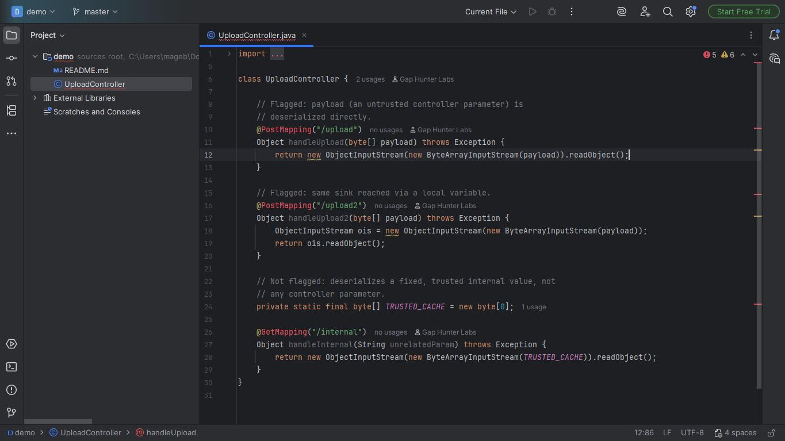
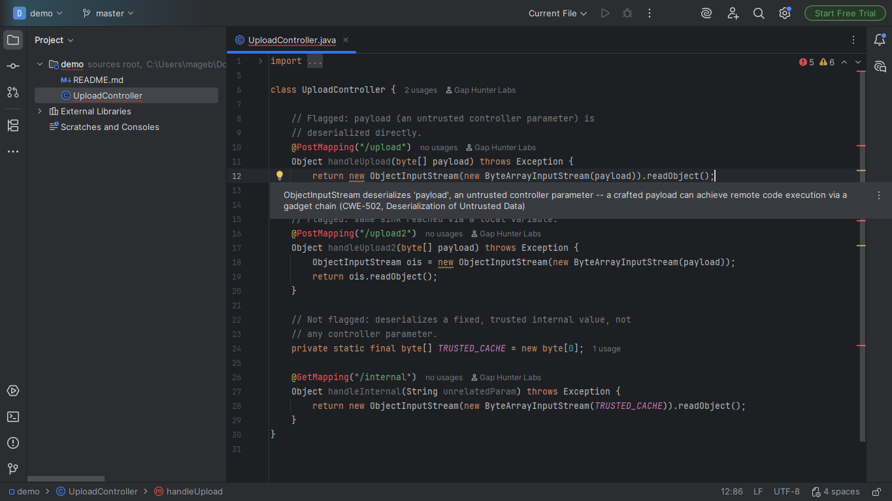
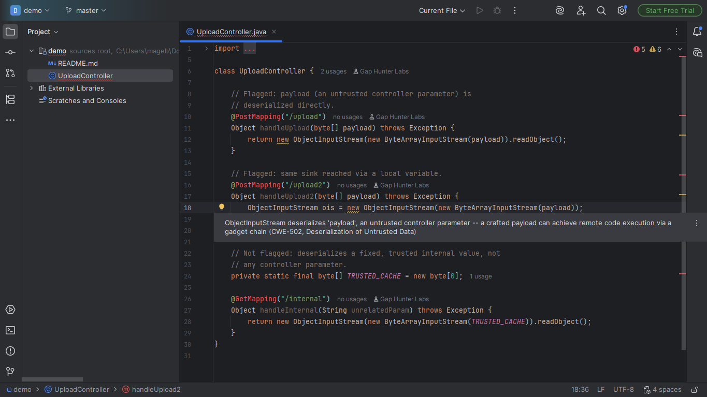
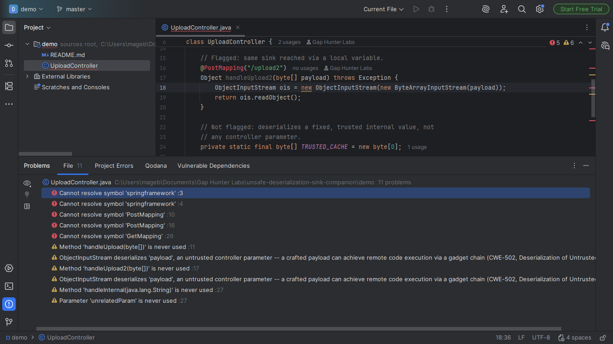

# Unsafe Deserialization Sink Companion

Warning on a `new ObjectInputStream(...).readObject()` call inside a
Spring MVC/JAX-RS endpoint method whose constructor argument traces
back (within the same method, one direct hop) to an untrusted
parameter -- CWE-502, Deserialization of Untrusted Data.

## Screenshots









## Why it exists

One of the most-cited OWASP Top 10 categories for Java, and a real
path to remote code execution via gadget chains. CodeQL covers this
exact source-to-sink category as a batch/CI query; no dedicated
Marketplace plugin does it as an inline IDE inspection.

## Why built this way

- Same source-to-sink principle CodeQL uses for this category,
  implemented with PSI alone -- no external analysis engine, no CI
  pipeline dependency.
- The untrusted source is a closed list of known Spring MVC/JAX-RS
  controller signatures (`@PostMapping`, `@GetMapping`, `@RequestMapping`,
  JAX-RS `@POST`/`@GET`/etc.), not a general taint analysis attempt.
- A construction that's never actually read from (`.readObject()`
  never called) is recognized as dead code, not a real sink.

## v0.1 scope — stated honestly, not exhaustively

Only follows the data within the SAME method and a direct one-hop
reference to a parameter -- never crosses more than one method of
distance, and never resolves a value assigned across multiple
intermediate variables.

## Usage

Open any Java file with a Spring MVC/JAX-RS endpoint method. A
`new ObjectInputStream(...).readObject()` call whose argument traces
back to an untrusted parameter shows a warning on the construction.

## Support

- **Bugs and feature requests:** [GitHub Issues](https://github.com/GapHunterLabs/unsafe-deserialization-sink-companion/issues)
- **Questions, or custom rules for a team's codebase:** **gaphunterlabs@gmail.com**
- **Security vulnerabilities:** report privately as described in [SECURITY.md](SECURITY.md), not in a public issue.
- **Privacy and network behavior:** [PRIVACY.md](PRIVACY.md)

## Development

```
./gradlew test           # unit tests
./gradlew buildPlugin    # generates build/distributions/*.zip
./gradlew verifyPlugin   # checks compatibility against real IDEs
```

## License

Apache-2.0. See `LICENSE`.
